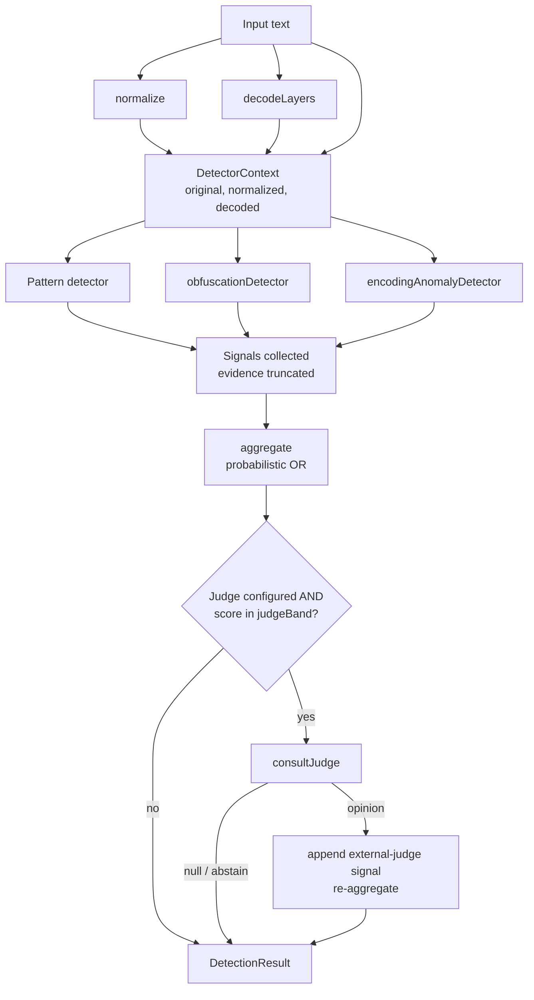
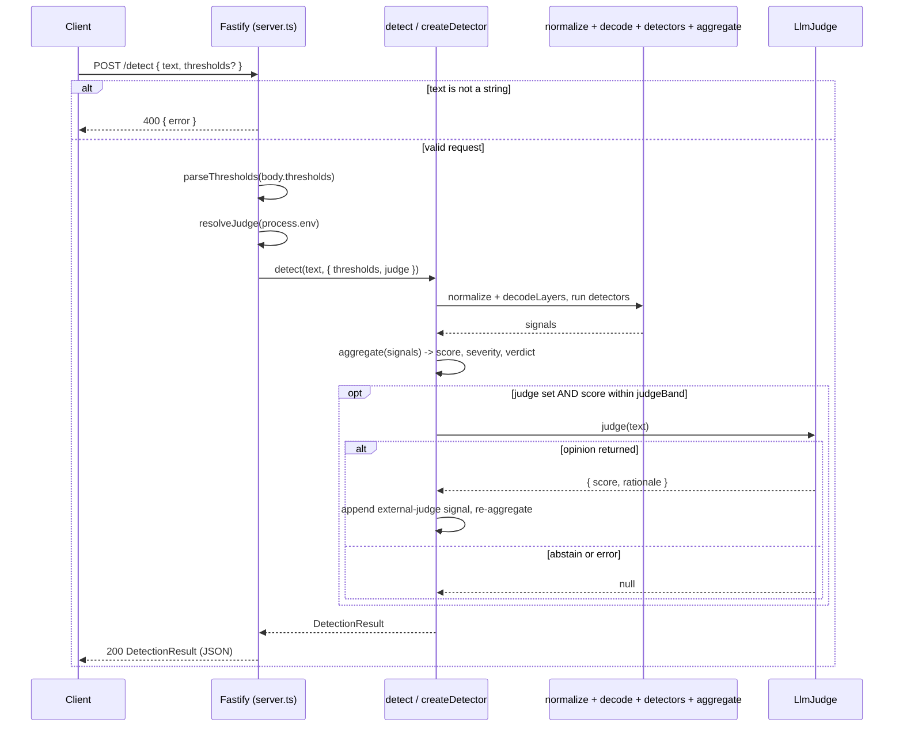

# Architecture

This document describes the internal structure of `prompt-injection-detector`. It
is written against the code in `src/` and reflects the implementation as it
exists, not a roadmap.

The detector analyzes a single string and returns a `DetectionResult`: a verdict
(`allow` / `flag` / `block`), an aggregate score in `[0,100]`, a severity band,
and the list of signals that fired. The core path is offline and deterministic.
An optional LLM judge can be attached as an asynchronous second opinion, and is
consulted only for inputs whose offline score lands in a configurable band.

## Design constraints

Three constraints shape every module:

1. **Untrusted input on the hot path.** Every function that touches the input
   must be total: it must not throw, regardless of input size, encoding, or
   adversarial construction. Failures degrade to "no signal" rather than
   propagating.
2. **Determinism in the core.** Normalization, decoding, rules, and scoring are
   pure and synchronous. The same input always produces the same offline result,
   which makes the engine testable without mocks and safe to run without network
   access.
3. **Provider inversion for the model.** The LLM is an injected dependency
   (`LlmJudge`) with a fail-safe contract, not a hard requirement. With no judge
   configured the engine is fully functional and network-free.

## Module map

| File                  | Responsibility                                                                                                                         |
| --------------------- | -------------------------------------------------------------------------------------------------------------------------------------- |
| `src/types.ts`        | Shared type vocabulary and default constants. No runtime logic beyond `SEVERITY_RANK` and the default tables.                          |
| `src/normalize.ts`    | Canonicalize input: NFKC, strip invisibles/marks, fold confusables, collapse whitespace, lowercase.                                    |
| `src/decode.ts`       | Reversible decoders (base64, hex, url, decimal char-codes, rot13) and a span scanner that surfaces `DecodedLayer`s.                    |
| `src/rules.ts`        | The `PatternRule` catalog (`defaultRules`) and `createPatternDetector`, which scans normalized text, decoded layers, and the original. |
| `src/detectors.ts`    | Two heuristic detectors: `obfuscationDetector` (normalization delta) and `encodingAnomalyDetector` (hidden decoded content).           |
| `src/score.ts`        | `aggregate` (probabilistic-OR combination plus verdict) and `scoreToSeverity` (score-to-band mapping).                                 |
| `src/detector.ts`     | `createDetector`: wires the pipeline, isolates each detector, and orchestrates the optional judge.                                     |
| `src/llm/provider.ts` | `LlmJudge` implementations: `noopJudge`, `AnthropicJudge`, and `resolveJudge` (environment-driven selection).                          |
| `src/index.ts`        | Public API surface and the `detect` convenience helper.                                                                                |
| `src/server.ts`       | Fastify HTTP server exposing `GET /health` and `POST /detect`.                                                                         |
| `src/cli.ts`          | `pid scan` command: input resolution, threshold parsing, output formatting, verdict-mapped exit codes.                                 |

### `types.ts`

Defines the contracts the rest of the system shares: `Severity` and its numeric
`SEVERITY_RANK`, `Verdict`, `SignalCategory`, `DecodedLayer`, `DetectionSignal`,
`DetectorContext`, the `Detector` interface, `Thresholds` (with
`DEFAULT_THRESHOLDS = { flag: 35, block: 70 }`), `DetectionResult`, `LlmJudge`,
and `DetectorConfig`.

Two contracts here are load-bearing:

- `Detector.run(ctx)` returns `DetectionSignal[]` **synchronously**. The
  interface has no `Promise` in it by design (see "Why detectors are pure and
  synchronous").
- `LlmJudge.judge(text)` returns `Promise<{ score; rationale } | null>`. Returning
  `null` means "abstain" — it is a first-class outcome, not an error.

### `normalize.ts`

`normalize(text)` produces the canonical form that string matchers scan. The
pipeline order is fixed:

```
NFKC -> stripZeroWidth -> foldConfusables -> collapse whitespace -> trim -> lowercase
```

NFKC runs first so compatibility decomposition (fullwidth, ligatures, some math
styles) happens before the explicit confusable map, minimizing how many entries
that map must carry. `BUILTIN_CONFUSABLES` then handles cross-script look-alikes
that NFKC deliberately does not fold (Cyrillic/Greek/Armenian homoglyphs) plus
leetspeak digit and symbol substitutions. `stripZeroWidth` removes zero-width and
bidi-control characters, the invisible Unicode Tag block (U+E0000–E007F), and
combining marks (so Zalgo-stacked text reduces to base letters).

Every function guards its body in `try/catch` and short-circuits on empty input,
honoring the totality constraint.

### `decode.ts`

`decodeLayers(text)` returns the `DecodedLayer[]` that downstream stages inspect.
Behavior:

- Whole-text **rot13** is always emitted unconditionally, so callers can rescan
  it without deciding whether the input "looks like" rot13.
- A permissive `TOKEN_SPAN` regex finds candidate encoded runs. Each span of at
  least `MIN_TOKEN_LENGTH` (12) is handed to every token decoder: `base64`,
  `hex`, `url`, `decimal-charcodes`.
- Each decoder is total and conservative: it validates its own charset/format,
  caps output at `MAX_DECODED_BYTES` (64 KiB), and rejects results that are not
  mostly printable ASCII (`PRINTABLE_THRESHOLD = 0.85`). A decoder returns `null`
  rather than surfacing binary noise.
- Duplicate decoded strings are deduplicated via a `seen` set, and a layer is
  only pushed when the decode actually differs from the raw span.

### `rules.ts`

`defaultRules` is a declarative catalog of `PatternRule`s, each with an `id`,
`category`, `severity`, a confidence `score` in `[0,1]`, a `message`, a list of
lowercased `phrases`, and optional `regexes`. Rules cover instruction override,
role confusion, system-prompt exfiltration, delimiter/role-token injection,
refusal suppression, data exfiltration, code execution, and obfuscation
wrappers, including multilingual variants.

`createPatternDetector(rules)` compiles the catalog once (regexes are
re-instantiated so a global `lastIndex` cannot leak state between runs, and
malformed regexes are dropped at construction). Its `run` then, per rule:

- matches `phrases` against `ctx.normalized`,
- matches `phrases` against `normalize(layer.text)` for each decoded layer,
- matches `regexes` against `ctx.original` (untouched, so case- and
  structure-sensitive payloads survive).

At most one signal is emitted per `(rule, source)` pairing. `source` records
where the match came from: `normalized`, `original`, or a decode `method`.

### `detectors.ts`

Two heuristic detectors complement the pattern catalog:

- **`obfuscationDetector`** counts confusable and zero-width characters in the
  original and scores by the fraction of characters that had to be folded during
  normalization. It fires when the folded ratio exceeds 5% or when there are at
  least three invisible characters. This catches disguised triggers even when the
  resulting normalized phrase does not match a rule verbatim.
- **`encodingAnomalyDetector`** fires when a decode layer surfaced genuinely
  hidden text: a non-rot13 transform whose output is at least 8 chars, mostly
  printable, and not already substantially present in the original (measured by
  `containmentRatio`). rot13 is excluded here because it is a trivial in-place
  substitution the pattern layer already rescans, not a smuggling channel.

Both are pure, synchronous `Detector` values.

### `score.ts`

`aggregate(signals, thresholds)` combines the per-signal confidences with a
**probabilistic OR**: `score = 1 - product(1 - clamp(s_i))`, scaled to `[0,100]`.
This treats signals as independent evidence — many weak signals accumulate, the
result stays bounded, and no single signal saturates the score the way a plain
sum would. The reported `severity` is the higher of the score-derived band
(`scoreToSeverity`) and the maximum per-signal severity, so a single `critical`
rule is never softened by a modest aggregate score. The `verdict` is derived
purely from the score and thresholds: `block` at/above `block`, else `flag`
at/above `flag`, else `allow`.

### `detector.ts`

`createDetector(config)` returns an object with a single async `detect(text)`
method. It is the only place async appears in the core, and the only IO is the
optional judge. Per call it:

1. computes `normalized` and `decoded`, builds the read-only `DetectorContext`;
2. runs each detector through `runDetector`, which wraps `run` in `try/catch` so a
   faulty or maliciously-triggered detector returns `[]` instead of breaking the
   others;
3. truncates each signal's evidence to `maxEvidenceLength` (default 120) so no
   single signal can carry an unbounded slice of attacker-controlled input;
4. calls `aggregate` for the offline score, severity, and verdict;
5. **only if** a judge is configured and the offline score falls within
   `judgeBand` (default `{ low: 25, high: 70 }`), consults the judge through
   `consultJudge` (which converts a rejected promise to `null`), appends an
   `external-judge` signal when the judge does not abstain, and re-aggregates.

The judge is never called for confidently-benign or confidently-malicious
inputs; it spends a network round-trip only where the offline engine is
genuinely uncertain.

### `llm/provider.ts`

`LlmJudge` has two implementations. `noopJudge` always resolves to `null`
(offline default). `AnthropicJudge` calls the Anthropic Messages API and is
deliberately fail-safe: any non-OK status, network error, or unparseable body
resolves to `null`. It caps input length (`MAX_INPUT_CHARS = 20000`) and output
tokens, and extracts the first JSON object from the response rather than assuming
the whole body parses. `resolveJudge(env)` returns an `AnthropicJudge` only when
`PID_LLM_PROVIDER === 'anthropic'` and `ANTHROPIC_API_KEY` is set; otherwise it
returns `noopJudge`. This is what makes "offline by default" the literal default.

### `index.ts`, `server.ts`, `cli.ts`

`index.ts` re-exports the public surface and provides `detect(text, config)`,
which constructs a fresh detector per call (convenient but stateless; callers
scanning many inputs should build one detector with `createDetector` and reuse
it).

`server.ts` builds a Fastify app with `GET /health` and `POST /detect`.
`createServer()` wires routes without binding a port (so tests can use `inject`);
`start(port)` binds. `/detect` validates that `text` is a string (400 otherwise),
narrows optional `thresholds`, resolves a judge from the environment, and returns
the `DetectionResult` as JSON.

`cli.ts` exposes `pid scan`. It resolves input in priority order (positional
argument, then `--file`, then stdin), parses `--flag-threshold`/`--block-threshold`
onto a 0–100 scale, prints either a human report or `--json`, and exits with a
verdict-mapped code (`allow` 0, `flag` 1, `block` 2) so the result composes in
shell pipelines.

## Detection pipeline



## Sequence: POST /detect



## Provider-inversion design: offline core, optional async judge

The engine separates two kinds of work that have very different cost and
reliability profiles:

- **Offline core** (normalize, decode, rules, heuristics, aggregate) is pure,
  synchronous, deterministic, and free. It runs with no network and no secrets,
  and it is the only thing that runs for the overwhelming majority of inputs.
- **External judge** is an injected `LlmJudge` — slow, billable, non-deterministic,
  and able to fail. It is inverted out of the core: the core depends on the
  `LlmJudge` interface, not on any concrete provider, and `resolveJudge` decides
  at the edge whether a real provider is wired in at all.

This yields several concrete properties:

- **Offline by default.** Without `PID_LLM_PROVIDER=anthropic` and an API key,
  `resolveJudge` returns `noopJudge` and the system never makes a network call.
- **Bounded use of the model.** Even when a judge is configured, `createDetector`
  only calls it when the offline score lands inside `judgeBand`
  (`{ low: 25, high: 70 }` by default). Confident allows and confident blocks are
  decided entirely offline.
- **Fail-safe.** A judge that throws, times out, returns a non-OK status, or emits
  unparseable output resolves to `null` in `consultJudge` / `AnthropicJudge`. An
  external failure can never fail an otherwise-complete detection; it simply
  proceeds on the offline result.
- **Testability and substitution.** Because the dependency is an interface,
  callers can supply their own judge (or none) and tests can exercise the core
  without any model at all.

## Why detectors are pure and synchronous

`Detector.run(ctx)` returns `DetectionSignal[]` directly, with no `Promise`. This
is a deliberate constraint, and it follows from the constraints above:

- **Determinism.** A pure, synchronous detector over a read-only
  `DetectorContext` always yields the same signals for the same context. That
  makes the catalog and heuristics testable as plain input/output functions, with
  no mocking, no clocks, and no network.
- **Isolation is cheap and complete.** `runDetector` wraps each call in a single
  synchronous `try/catch`. A faulty detector returns `[]` and the others are
  unaffected. There is no partially-resolved async state to reason about.
- **No IO in the inner loop.** Keeping detectors synchronous prevents accidental
  IO from creeping into the per-input hot path. The single sanctioned point of IO
  — the LLM judge — is held outside the detector set and handled explicitly in
  `detector.ts`, under the band and fail-safe rules above. The core's only `async`
  is the orchestration of that one optional call.

In short: detectors are the deterministic, side-effect-free substrate; all
non-determinism and IO are concentrated in one inverted, optional, fail-safe
dependency.
