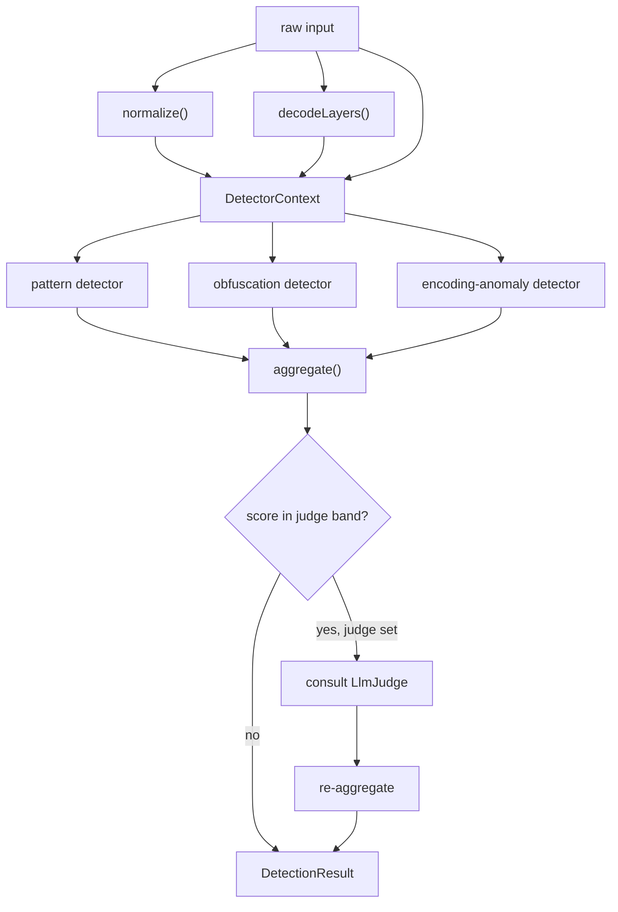

# Design Decisions

This note records the load-bearing design decisions in the prompt-injection-detector
and why each was chosen over the obvious alternative. It is meant to be read by
someone changing the detection engine, not by a first-time user; for the surface
API and pipeline overview see [[Architecture]] and [[Detection Pipeline]].

The engine is a fixed pipeline: normalize and decode the input, run a set of pure
detectors over the derived views, then aggregate their signals into a single
score, severity, and verdict. The decisions below concern the seams between those
stages.

## 1. Provider inversion: the LLM is an injected dependency, never a hard edge

The core detection path makes no network call. The only IO is an optional
`LlmJudge`, which is supplied by the caller through `DetectorConfig.judge` rather
than constructed inside the engine.

- `LlmJudge` (`src/types.ts`) is a two-method interface: a `name` and an async
  `judge(text) => { score, rationale } | null`. The engine depends only on that
  shape.
- `createDetector` (`src/detector.ts`) accepts the judge in config and treats its
  absence as the default. With no judge configured the detector is fully
  synchronous in spirit and offline in fact.
- Provider selection lives at the edge in `resolveJudge` (`src/llm/provider.ts`),
  which reads the environment and returns either an `AnthropicJudge` (only when
  `PID_LLM_PROVIDER === 'anthropic'` and `ANTHROPIC_API_KEY` is set) or the
  `noopJudge`. The default is the no-op, so the package runs offline unless a
  provider is explicitly opted into.

Why this way:

- **Testability.** Detection logic is exercised without a network or a real
  model. A test can pass a stub judge with a known score, or omit it entirely.
- **Fail-safe degradation.** The judge is consulted through `consultJudge`, which
  wraps the call in a try/catch and returns `null` on any rejection. A judge that
  abstains (`null`) or throws does not change an otherwise-complete result; the
  detection simply proceeds without the second opinion. See [[LLM Judge]].
- **No vendor lock-in in the core.** Swapping or adding a provider is a change at
  the edge (`resolveJudge` plus a new `LlmJudge` implementation), not a change to
  the engine.

The rejected alternative was constructing an HTTP client inside the detector and
gating it behind a flag. That couples the engine to a specific transport and
makes the offline path the exception rather than the rule.

## 2. Detectors are pure and synchronous

A `Detector` (`src/types.ts`) is `{ id, category, run(ctx) => DetectionSignal[] }`.
`run` is declared pure and synchronous: it receives a read-only `DetectorContext`
(`original`, `normalized`, `decoded`) and returns signals. It performs no IO and
holds no state across calls.

This is enforced and exploited in several places:

- `runDetector` (`src/detector.ts`) wraps each `run` in a try/catch and returns
  `[]` on throw, so a faulty or maliciously-triggered detector cannot break the
  others. Isolation is cheap precisely because the contract is synchronous — there
  is no promise to chase, no partial async state to unwind.
- `createPatternDetector` (`src/rules.ts`) precompiles its rules once at
  construction and then only reads in `run`. Detectors are values that can be
  shared across inputs.
- The context is computed once per input (`normalize`, `decodeLayers`) and handed
  to every detector, so detectors never re-derive shared views.

Why this way: purity makes each detector independently testable and trivially
parallelizable in principle, and keeps the per-input cost predictable. The only
asynchrony in the whole flow is the judge, which is deliberately quarantined in
`createDetector` after the synchronous signals are already collected. The built-in
set is `createPatternDetector(defaultRules)`, `obfuscationDetector`, and
`encodingAnomalyDetector` (`src/detectors.ts`); see [[Detectors]].



## 3. Probabilistic-OR scoring instead of a sum or a max

`aggregate` (`src/score.ts`) combines per-signal confidences with a probabilistic
OR:

```
combined = 1 - product(1 - clamp(s_i, 0, 1))
score    = round(combined * 100)   // 0..100
```

Each signal's `score` is treated as the probability that this one piece of
evidence indicates an attack, and the signals are combined as independent
evidence. The properties that motivated this choice:

- **Bounded.** The result stays in [0,1] (then scaled to [0,100]) no matter how
  many signals fire. A plain sum saturates and forces an arbitrary cap; the
  product form never exceeds 1.
- **Monotonic accumulation.** Many weak signals raise the score without any single
  one dominating, and adding evidence can only increase the score. Two medium
  signals at 0.45 combine to ~0.70, which is the behavior we want for "several
  soft tells add up."
- **No single-signal ceiling.** Unlike `max`, a strong signal does not swallow the
  contribution of the others; unlike a sum, it does not let one rule blow past the
  scale on its own.

Severity is computed separately and is the **higher** of the band derived from
the aggregate score (`scoreToSeverity`) and the maximum severity among the
individual signals. This means a single `critical` rule reports `critical` even
when the numeric score lands in a lower band — the score answers "how much
evidence," severity answers "how bad is the worst thing seen."

The verdict is a pure threshold cut on the score using `Thresholds`
(`flag`/`block`, default `{ flag: 35, block: 70 }`): at or above `block` it is
`block`, at or above `flag` it is `flag`, otherwise `allow`. Keeping the verdict a
function of the score (not the signals) means callers can retune sensitivity
without touching rules. See [[Scoring]].

When the judge fires, its opinion is appended as an `external-judge` signal
(`score` in [0,1], severity from `scoreToSeverity(score*100)`) and the aggregate
is recomputed — so the judge participates in the same probabilistic-OR rather than
overriding the verdict. It is only consulted when the pre-judge score falls inside
`judgeBand` (default `{ low: 25, high: 70 }`), i.e. for genuinely borderline
inputs.

## 4. Phrase-based rules over regex as the default matcher

A `PatternRule` (`src/rules.ts`) carries a list of lowercased `phrases` and an
optional list of `regexes`. The two are applied to different views, by design:

- **Phrases** are matched as plain substrings against the **normalized** text
  (NFKC, confusables folded, zero-width stripped, whitespace collapsed,
  lowercased) and against the normalized form of every decoded layer. Phrases are
  the primary mechanism: nearly every rule in `defaultRules` is phrase-only.
- **Regexes** run against the **untouched original**, reserved for the rare cases
  where case or structure must survive (control tokens, payload shapes).

Why phrases carry the load:

- **Robust under obfuscation by construction.** Because matching happens after
  normalization, a single phrase such as `ignore previous instructions`
  transparently catches Cyrillic homoglyphs, fullwidth forms, zero-width padding,
  leetspeak digit substitution, and mixed case — without the rule author writing
  any character classes. The normalizer (`src/normalize.ts`) does the disguise
  removal once; rules stay readable. See [[Normalization]].
- **Auditable and low-risk.** A substring is `O(n·m)` with no backtracking. There
  is no catastrophic-backtracking foot-gun, no `lastIndex` state to leak, and the
  catalog reads as a plain list a reviewer can scan for false-positive risk
  (several rules are explicitly annotated as benign-collision-prone with lower
  scores, e.g. `rule.soft-override-social` at 0.45).
- **Defense in depth, not regex avoidance.** Regexes are still supported, but they
  are the exception and are hardened: `compileRule` re-instantiates each regex in
  a try/catch and drops malformed ones at construction time, and `firstRegexMatch`
  guards `exec` so a pathological input cannot throw out of a detector.

The matcher emits at most one signal per `(rule, source)` pairing, where `source`
records which view fired (`normalized`, `original`, or a decode method such as
`base64`/`rot13`). This keeps evidence attributable to the layer it came from.
See [[Rules]].

The rejected alternative was a regex-first catalog. It would have pushed unicode
and encoding handling into every rule, multiplied backtracking risk across
hundreds of patterns, and made the catalog far harder to review for false
positives.

## Cross-cutting: bounded, total, fail-safe

Two smaller decisions recur throughout and support the four above:

- **Totality.** Normalizer and decoders never throw; they return the input
  unchanged or `null` on failure. Detectors are isolated. The judge degrades to
  abstention. A single bad input or component cannot fail the whole scan.
- **Bounded evidence.** Every signal's `evidence` is truncated
  (`maxEvidenceLength`, default 120) so attacker-controlled input cannot carry an
  unbounded slice into logs or callers. Decoders cap decoded size
  (`MAX_DECODED_BYTES`) to prevent amplification from a small encoded blob.

## Related

- [[Architecture]]
- [[Detection Pipeline]]
- [[Normalization]]
- [[Detectors]]
- [[Rules]]
- [[Scoring]]
- [[LLM Judge]]
