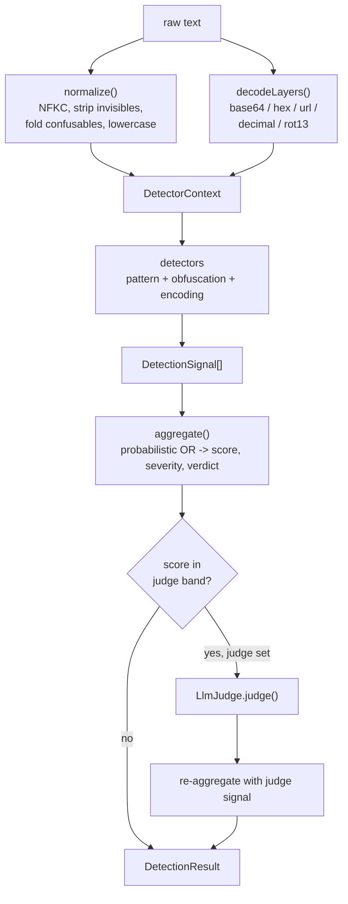

# Home

This vault documents the **prompt-injection-detector**: a layered detector for
prompt-injection and jailbreak attempts in text that will be fed to an LLM. The
same engine runs as a library (`detect` / `createDetector`), an HTTP API
(`src/server.ts`, Fastify), and a CLI (`src/cli.ts`, the `pid` command). The core
detection path is offline — normalization, decoding, and pattern rules do the
work, with an optional LLM judge consulted only for borderline scores.

These notes describe the implementation as it stands in `src/`. They are
reference material for the design, not a tutorial; start from the map below.

## Map of contents

- [[Design Decisions]] — why detection is a pipeline of pure, isolated stages;
  the probabilistic-OR aggregation; fail-safe IO; evidence truncation; and the
  per-call vs. reused-detector tradeoff.
- [[Rule Taxonomy]] — the nine `SignalCategory` families, the `defaultRules`
  catalog, and how phrase/regex matching and severity/score are assigned.
- [[Threat Model]] — what the detector is meant to catch (homoglyphs, zero-width
  smuggling, encoded payloads, role confusion, exfiltration, code execution) and
  its known limits and non-goals.
- [[Glossary]] — the core types and terms: `DetectionResult`, `DetectionSignal`,
  `Severity`, `Verdict`, `DecodedLayer`, judge band, thresholds.

## How analysis flows

## Source layout

- `src/types.ts` — the shared type surface (see [[Glossary]]).
- `src/normalize.ts` — `normalize`, `foldConfusables`, `stripZeroWidth`,
  `BUILTIN_CONFUSABLES`.
- `src/decode.ts` — `decodeLayers` and the per-encoding decoders.
- `src/rules.ts` — `defaultRules`, `PatternRule`, `createPatternDetector`.
- `src/detectors.ts` — `obfuscationDetector`, `encodingAnomalyDetector`.
- `src/score.ts` — `aggregate`, `scoreToSeverity`.
- `src/detector.ts` — `createDetector`, the orchestrator that runs the stages and
  consults the judge.
- `src/llm/provider.ts` — `noopJudge`, `AnthropicJudge`, `resolveJudge`.
- `src/server.ts` — Fastify `createServer` / `start` (`GET /health`, `POST /detect`).
- `src/cli.ts` — the `pid scan` command.
- `src/index.ts` — public exports plus the `detect(text, config?)` convenience
  helper and `VERSION`.
