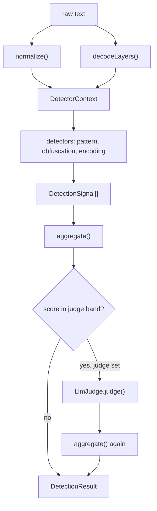

# prompt-injection-detector vault

This folder is an Obsidian vault. Open the folder in Obsidian (Open folder as vault) and start at [[Home]]. The pages document the detector implemented under `../src`; links use Obsidian wiki-link syntax and are meant to be followed inside the app rather than read as flat files.

## What this documents

A layered detector for prompt-injection and jailbreak attempts in text destined for an LLM. The core path is synchronous and network-free: normalization, decoding, and pattern rules produce a set of signals, those signals are aggregated into a `0-100` score, and the score maps to a `Verdict` of `allow`, `flag`, or `block`. An optional LLM judge is consulted only for borderline scores.

The same engine is exposed three ways: as a library (`detect`, `createDetector`), as an HTTP service (`createServer` / `start`), and as a CLI (`pid scan`).

## Pipeline

## Core types

Defined in `../src/types.ts`.

- `Severity` — `'none' | 'low' | 'medium' | 'high' | 'critical'`, ordered by `SEVERITY_RANK`.
- `Verdict` — `'allow' | 'flag' | 'block'`.
- `SignalCategory` — `instruction-override`, `role-confusion`, `system-exfiltration`, `delimiter-injection`, `refusal-suppression`, `data-exfiltration`, `code-execution`, `obfuscation`, `external-judge`.
- `DecodedLayer` — `{ method, text, span? }`, a reversible decode of part of the input.
- `DetectionSignal` — `{ id, category, severity, score, message, evidence?, source }`. `score` is a confidence in `[0,1]`; `source` is `'original'`, `'normalized'`, `'judge'`, or a decode method name.
- `DetectorContext` — `{ original, normalized, decoded }`, read-only, handed to every detector.
- `Detector` — `{ id, category, run(ctx): DetectionSignal[] }`. Implementations must be pure and synchronous.
- `Thresholds` — `{ flag, block }` on a `0-100` scale. `DEFAULT_THRESHOLDS = { flag: 35, block: 70 }`.
- `DetectionResult` — `{ verdict, score, severity, signals, length, decoded, elapsedMs }`.
- `LlmJudge` — `{ name, judge(text): Promise<{ score, rationale } | null> }`. Returns `null` to abstain.
- `DetectorConfig` — `{ thresholds?, detectors?, maxEvidenceLength?, judge?, judgeBand? }`.

## Public API

Exported from `../src/index.ts`.

- `detect(text, config?): Promise<DetectionResult>` — builds a fresh detector per call. Convenient but stateless; for many inputs reuse one detector instead.
- `createDetector(config?): { detect(text): Promise<DetectionResult> }` — builds a detector once and reuses its rule set.
- `normalize`, `foldConfusables`, `stripZeroWidth`, `BUILTIN_CONFUSABLES` — from the normalizer.
- `decodeLayers` — the decode-layer scanner.
- `defaultRules`, `createPatternDetector`, `PatternRule` — the pattern layer.
- `obfuscationDetector`, `encodingAnomalyDetector` — the two non-pattern detectors.
- `aggregate`, `scoreToSeverity` — scoring.
- `noopJudge`, `AnthropicJudge`, `resolveJudge` — judge implementations and environment selection.
- `VERSION` — `'0.1.0'`.

`DetectorConfig` defaults applied by `createDetector`: `detectors` defaults to `[createPatternDetector(defaultRules), obfuscationDetector, encodingAnomalyDetector]`; `maxEvidenceLength` to `120`; `judgeBand` to `{ low: 25, high: 70 }`.

## Stages

### Normalization (`../src/normalize.ts`)

`normalize(text)` applies, in order: NFKC, then `stripZeroWidth` (zero-width and bidi controls, the U+E0000–E007F Tag block, and combining marks), then `foldConfusables` (Cyrillic/Greek/Armenian look-alikes, math-alphanumeric and fullwidth forms, and leetspeak substitutions from `BUILTIN_CONFUSABLES`), then whitespace-run collapse, trim, and lowercase. Every function is total and never throws; on any internal error it returns the input unchanged (or `''` for empty input).

### Decoding (`../src/decode.ts`)

`decodeLayers(text)` returns `DecodedLayer[]`. Whole-text `rot13` is always emitted. Token spans at least `MIN_TOKEN_LENGTH` (12) characters long are run through base64, hex, url, and decimal-charcodes decoders. Each decoder is total, returns `null` when the charset does not match, caps output at `MAX_DECODED_BYTES` (64 KiB), and requires the result to be at least `PRINTABLE_THRESHOLD` (0.85) printable ASCII. Duplicate decoded strings are de-duplicated.

### Pattern detector (`../src/rules.ts`)

`createPatternDetector(rules = defaultRules)` returns a `Detector` with id `pattern`. For each `PatternRule` it matches lowercased `phrases` against `ctx.normalized` and against `normalize(layer.text)` for every decoded layer, and matches optional `regexes` against `ctx.original`. At most one signal is emitted per `(rule, source)` pair. Rules are compiled once; malformed regexes are dropped at construction. `defaultRules` covers instruction override, role confusion, system-prompt exfiltration, delimiter/role-token injection, refusal suppression, data exfiltration, code execution, and obfuscation wrappers, including non-English phrasings.

### Obfuscation and encoding detectors (`../src/detectors.ts`)

`obfuscationDetector` (id `obfuscation`) counts confusable and invisible characters in the original and fires when more than 5% of characters were folded, or when there are at least 3 invisible characters; the score scales with the folded ratio. `encodingAnomalyDetector` (id `encoding`) fires when a non-rot13 decode layer surfaced substantial, mostly-printable text that is not already present in the original (containment ratio at or below 0.6); the score scales with hidden-payload length.

### Scoring (`../src/score.ts`)

`aggregate(signals, thresholds?)` combines signal confidences with a probabilistic OR: `score = round((1 - product(1 - s_i)) * 100)`, clamped to `[0,100]`. Severity is the higher of the band severity (`scoreToSeverity`) and the maximum signal severity. The verdict is `block` at or above `thresholds.block`, `flag` at or above `thresholds.flag`, else `allow`. No signals yields `{ score: 0, severity: 'none', verdict: 'allow' }`.

### LLM judge (`../src/llm/provider.ts`)

The judge is consulted only when the aggregate score falls within `judgeBand` (`low <= score <= high`). `noopJudge` always abstains. `AnthropicJudge` calls the Anthropic Messages API, truncating input to `MAX_INPUT_CHARS` (20000) and parsing a single `{ "score", "rationale" }` JSON object from the response; any network, status, or parse error resolves to `null`. `resolveJudge(env)` returns an `AnthropicJudge` only when `PID_LLM_PROVIDER === 'anthropic'` and `ANTHROPIC_API_KEY` is set (model from `ANTHROPIC_MODEL`, default `claude-opus-4-8`); otherwise it returns `noopJudge`, so the engine runs offline by default. A judge opinion is added as an `external-judge` signal and the result is re-aggregated.

The orchestration in `../src/detector.ts` isolates each detector run and the judge call in `try/catch` so one failure cannot break the rest, and truncates every signal's `evidence` to `maxEvidenceLength`.

## Surfaces

### CLI (`../src/cli.ts`)

`pid scan [text]` reads input from the positional argument, then `--file <path>`, then stdin. Options: `-j, --json`, `--flag-threshold <n>`, `--block-threshold <n>` (each `0-100`; `flag` may not exceed `block`). It calls `resolveJudge()` from the environment. Exit codes encode the verdict: `allow` 0, `flag` 1, `block` 2; usage errors exit 64.

### HTTP (`../src/server.ts`)

Fastify. `GET /health` returns `{ status: 'ok', version }`. `POST /detect` accepts `{ text: string, thresholds?: { flag, block } }`; a missing or non-string `text` returns 400, otherwise it returns the `DetectionResult`. `createServer()` wires routes without binding a port (for `inject` in tests); `start(port?)` binds (`PORT` env or 3000). The judge is selected via `resolveJudge()`.

## Build and test

From the repo root: `pnpm install`, `pnpm run build`, `pnpm run lint`, `pnpm run typecheck`, `pnpm run test:cov`.

## Index

- [[Home]]
