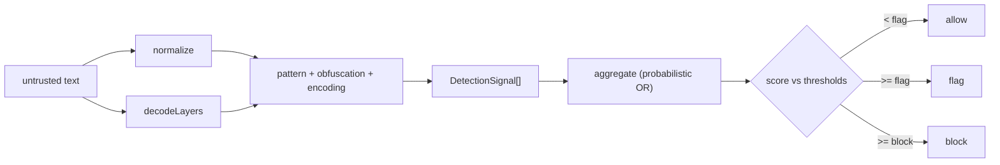

# Threat Model

This note describes what the prompt-injection-detector is built to catch, how each
defense is realized in `src/`, and the attacks and conditions it does not handle.
It is grounded in the implementation as it stands, not an aspirational spec. For
the rule catalog see [[Rule Taxonomy]]; for the reasoning behind the pipeline
shape see [[Design Decisions]].

## Asset and trust boundary

The asset under protection is an LLM (or LLM-backed agent) that will consume a
piece of text the operator does not fully trust: a user message, a retrieved
document, a tool result, a web page, an email body. The detector sits in front of
that consumption point and returns a `DetectionResult` carrying a `verdict`
(`allow` / `flag` / `block`), an aggregate `score` in `[0,100]`, a `severity`,
and the `signals` that fired.

The trust boundary is the input string. Everything inside `detect()` treats that
string as adversarial:

- The core path performs **no network IO**. `normalize`, `decodeLayers`, and the
  pattern/obfuscation/encoding detectors are pure and synchronous.
- The only optional IO is the LLM judge, and it is consulted solely for borderline
  scores and is fail-safe (see [[Design Decisions]]).
- Decode output is bounded (`MAX_DECODED_BYTES = 64 * 1024` in `src/decode.ts`)
  so a small encoded blob cannot amplify into a large allocation.
- Evidence carried back to the caller is truncated (`maxEvidenceLength`, default 120) so a single signal cannot smuggle an unbounded slice of attacker-controlled
  text into logs.
- Judge input is capped (`MAX_INPUT_CHARS = 20000` in `src/llm/provider.ts`).

## What the detector treats as in-scope

The defenses map to the `SignalCategory` families in `src/types.ts` and to the
three detectors wired in `src/detector.ts`: `createPatternDetector(defaultRules)`,
`obfuscationDetector`, and `encodingAnomalyDetector`.

### Visual disguise (homoglyphs, zero-width, bidi, Zalgo)

An attacker can hide a trigger phrase behind characters that render like ASCII but
are not. Two layers respond:

- `normalize()` (`src/normalize.ts`) runs NFKC, strips zero-width and bidi-control
  characters (`ZERO_WIDTH_PATTERN`), strips the invisible Unicode Tag block
  `U+E0000–E007F` (`TAG_BLOCK_PATTERN`), drops combining marks so Zalgo stacking
  reduces to base letters (`COMBINING_MARK_PATTERN`), folds cross-script
  look-alikes and leet substitutions via `BUILTIN_CONFUSABLES`, collapses
  whitespace, and lowercases. Pattern rules then scan this canonical form, so a
  disguised `ignore previous instructions` still matches.
- `obfuscationDetector` (`src/detectors.ts`) independently re-counts confusables
  and invisible characters against the **original** and emits an
  `obfuscation.normalization-delta` signal when a material fraction of the input
  had to be folded (`foldedRatio > 0.05`) or there is a non-trivial invisible run
  (`zeroWidth >= 3`). This catches disguise even when the de-disguised text
  matches no rule.

### Encoded / smuggled payloads

Triggers can be hidden inside base64, hex, URL-encoding, decimal char codes, or
rot13. `decodeLayers()` (`src/decode.ts`) surfaces these as `DecodedLayer`s; each
decoder is total (returns `null` rather than throwing) and only accepts output
that is mostly printable ASCII (`PRINTABLE_THRESHOLD = 0.85`).

- `createPatternDetector` rescans every decoded layer (after normalizing it), so a
  base64-wrapped override phrase is matched in the decoded text and attributed to
  `source: '<method>'`.
- `encodingAnomalyDetector` fires `encoding.hidden-<method>` when a non-rot13
  decode produced substantial, mostly-printable text that is **not already present
  verbatim in the original** (`containmentRatio > 0.6` is skipped). rot13 is
  excluded because it is a trivial in-place substitution the pattern layer already
  rescans, not a smuggling channel.

### Instruction override and role confusion

The bulk of `defaultRules` targets the classic attacks: nullifying prior or system
instructions (`rule.ignore-previous-instructions`), reset/forget framing, explicit
system-prompt override, named jailbreak personas (DAN and others), unrestricted-AI
coercion, dual-persona splits, and authority impersonation (developer/admin/root).
Phrases are stored lowercased and matched against the normalized text; a parallel
multilingual rule set covers non-English phrasings. See [[Rule Taxonomy]] for the
full breakdown of categories, severities, and scores.

### Delimiter / structural injection

Forged chat-role tokens (`<|im_start|>system`, `<|system|>`, `[INST]`), fake role
headers, pseudo-structural override banners, indirect-injection markers addressed
to "any AI reading this," and instructions buried in comments/markup are covered
by the `delimiter-injection` rules. These are the primary defense against
**indirect** injection — payloads embedded in documents or tool output rather than
typed by the user.

### Refusal suppression

Rules in the `refusal-suppression` family flag attempts to forbid refusal, demand
removal of safety language, force an affirmative compliance prefix, or use
continuation/prefill tricks. Some carry deliberately low scores because they
collide with benign text (for example `rule.educational-framing` at `0.45`).

### Data exfiltration and code execution

The highest-severity rules target outcomes rather than framing: sending
conversation or user data to an external destination, reading secrets/credentials,
zero-click image/markdown exfiltration channels, agentic side-channels
(browser/webhook/DNS), pipe-to-shell execution, destructive commands, reverse
shells, SQL-injection payloads, and persistence/privilege escalation. These are
the categories most relevant to **tool-using agents**, where a successful
injection can act, not just talk.

## How signals become a verdict

`aggregate()` (`src/score.ts`) combines per-signal confidences with a
probabilistic OR — `1 - product(1 - s_i)` — so many weak signals accumulate
without any single one saturating the result, and the score stays bounded in
`[0,1]` before scaling to `[0,100]`. Severity is the max of the band-derived
severity and the highest individual signal severity. The verdict is a pure
threshold cut: `score >= block` → `block`, else `score >= flag` → `flag`, else
`allow`. Defaults are `flag: 35`, `block: 70` (`DEFAULT_THRESHOLDS`).

A faulty or maliciously-triggered detector cannot break the others: every
`detector.run` is wrapped in a try/catch in `src/detector.ts` and a throw
degrades to an empty signal list.

## Out of scope and known limits

The detector is a **pre-filter that scores text**, not a guarantee. The following
are explicit non-goals or known gaps:

- **It does not inspect model output.** It scores input only; it cannot tell
  whether the model actually complied. Output-side filtering is a separate concern.
- **It does not enforce the verdict.** It returns `allow` / `flag` / `block`; the
  caller decides what to do. The CLI maps verdicts to exit codes (`allow` 0,
  `flag` 1, `block` 2) and the HTTP API returns the result as JSON, but neither
  blocks anything itself.
- **Pattern matching is finite and English-weighted.** Detection rests on a
  curated phrase/regex catalog. Novel phrasings, paraphrases, and languages or
  scripts outside the multilingual rules and the confusable map will be missed.
  The optional LLM judge exists precisely to cover ambiguous cases the static
  rules cannot, but it is off by default and only consulted within the judge band
  (default `{ low: 25, high: 70 }`).
- **Confusable folding is a fixed list, not full Unicode confusables.**
  `BUILTIN_CONFUSABLES` covers common Cyrillic/Greek/Armenian/math/fullwidth
  look-alikes and leet substitutions; an attacker using look-alikes outside this
  set evades the fold (though the un-folded character may still raise the
  `obfuscation` ratio).
- **Decoding is limited to a fixed set of reversible transforms.** Only base64,
  hex, URL-encoding, decimal char codes, and rot13 are attempted, and only on
  spans of at least `MIN_TOKEN_LENGTH` (12) chars. Nested encodings beyond one
  layer, custom ciphers, compression, and split-across-tokens payloads are not
  decoded.
- **Leet/digit folding has a false-positive cost.** Folding `0→o`, `1→l`, `3→e`,
  etc. de-disguises some attacks but also rewrites legitimate text containing
  digits; this is a deliberate recall-over-precision tradeoff (see
  [[Design Decisions]]).
- **Benign collisions are expected for soft rules.** Several rules
  (`rule.soft-override-social`, `rule.educational-framing`,
  `rule.suppress-disclaimers`) intentionally fire on phrasing that also appears in
  legitimate text, with low scores chosen so they flag rather than block on their
  own.
- **No statefulness across turns.** Each `detect()` call scores one string in
  isolation. Multi-turn / crescendo attacks that are benign per message are not
  modeled.
- **The judge is a second opinion, not a backstop.** When configured it is
  consulted only inside the judge band, runs once, and abstains (resolves `null`)
  on any network, status, or parse error, leaving the static verdict in place. It
  is not a fallback for inputs the rules score as clearly benign or clearly
  malicious.

## Attacker capabilities assumed

The model assumes an attacker who fully controls the input string and may:

- substitute look-alike, fullwidth, math-style, or leet characters;
- insert zero-width, bidi-control, Tag-block, and combining characters;
- wrap payloads in base64/hex/URL/decimal/rot13;
- forge chat-role tokens and structural delimiters;
- embed instructions inside documents/markup intended for a model to read
  (indirect injection); and
- attempt exfiltration or code/tool execution against an agentic consumer.

The model does **not** assume the attacker can influence the detector's own
configuration, the rule catalog, the thresholds, or the judge credentials — those
sit on the operator's side of the trust boundary.

## Related

- [[Rule Taxonomy]] — the category families and `defaultRules` catalog.
- [[Design Decisions]] — pipeline shape, probabilistic-OR aggregation, fail-safe
  IO, evidence truncation.
- [[Glossary]] — `DetectionResult`, `DetectionSignal`, `Severity`, `Verdict`,
  `DecodedLayer`, judge band, thresholds.
